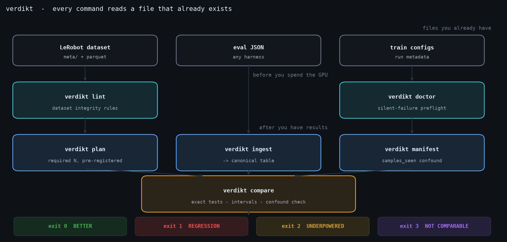
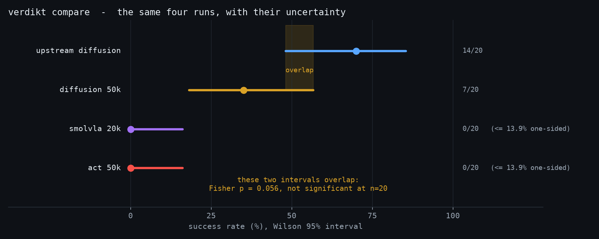
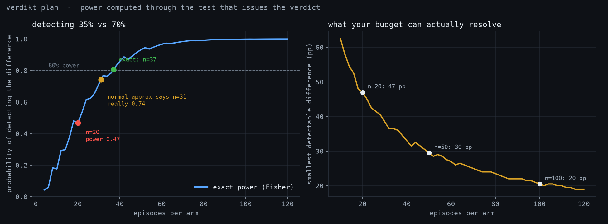
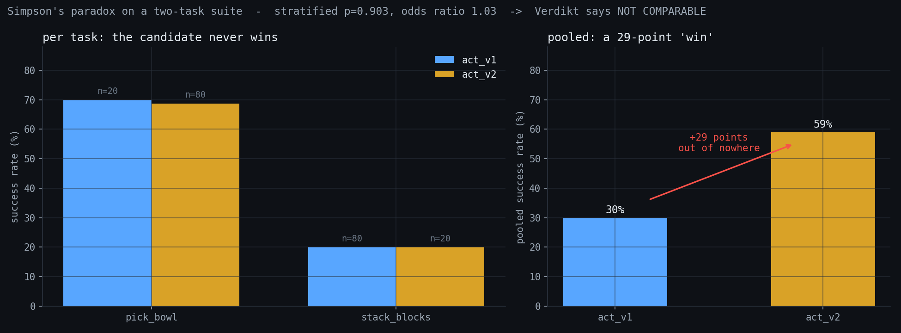
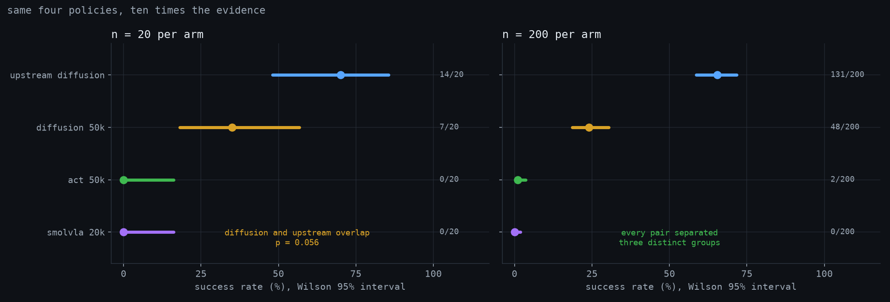

<div align="center">

<h1>Verdikt</h1>

**Your eval printed a success rate. Verdikt tells you whether you're allowed to believe it.**

A CPU-only decision layer for robot-policy evaluation. It reads the eval JSON, dataset files
and run configs you already have — and refuses to let you draw a conclusion the data does not
support.

[](https://pypi.org/project/verdikt-eval/)
[](https://www.python.org/)
[](LICENSE)
[](#)
[](https://relaxed-heliotrope-271cc3.netlify.app)
[](tests/)
[](https://codecov.io/gh/muhammadmahadazher/Verdikt)
[](https://github.com/huggingface/lerobot)



</div>

---

## The problem, in one picture

Two policies. Twenty episodes each. One scored 35%, the other 70%. Ship the winner?

<div align="center">

</div>

**No.** At n=20 that comparison is `p = 0.056` — the intervals overlap, and the difference is
not significant. Meanwhile "0/20 = 0%" actually means *"below 13.9%"*, and the two 0/20 arms
are statistically indistinguishable from each other (`p = 1.000`).

Every number above was produced by the command below, from files that already existed.

```bash
verdikt compare results/*.json --baseline diffusion_50k
```

---

## What Verdikt does

| Command | Question it answers | Exit |
|---|---|---|
| `verdikt doctor` | Is my training stack about to fail *silently*? | 0 / 2 |
| `verdikt lint` | Is this dataset going to waste my GPU-hours? (10 rules) | 0 / 2 |
| `verdikt ingest` | Turn any harness's eval output into one canonical table | 0 |
| `verdikt plan` | How many episodes do I actually need? | 0 |
| `verdikt manifest` / `diff` | Are these two runs even comparable? | 0 / 3 |
| `verdikt compare` | Is checkpoint B **really** better than A? (paired or unpaired) | 0 / 1 / 2 / 3 |
| `verdikt watch` | Can I **stop this eval early**? | 0 / 2 |
| `verdikt report` | Give me something to hand my lead | 0 / 1 / 2 / 3 |

### The four-state verdict

Most gates are binary: pass or fail. Success rates are stochastic, so a binary gate on a
binomial produces constant false alarms. Verdikt returns four states, so "I can't tell yet"
is a first-class answer instead of a silent pass:

| Exit | State | Meaning |
|:---:|---|---|
| `0` | **BETTER** | no regression — ship it |
| `1` | **REGRESSION** | candidate is significantly worse |
| `2` | **UNDERPOWERED** | cannot decide at this n — *here is the n that would* |
| `3` | **NOT COMPARABLE** | a confound makes the comparison meaningless |

---

## Install

> **Requirements:** Python 3.10+. No GPU. No robot. No simulator. Nothing to configure.

```bash
pip install verdikt-eval
```

That is the whole install, on Windows, Linux and macOS alike — Verdikt is pure CPU Python, so
Apple Silicon and Intel both just work. Prefer an isolated tool install? `pipx install
verdikt-eval` or `uv tool install verdikt-eval`.

> **On the name:** the distribution is **`verdikt-eval`** because plain `verdikt` is held on
> PyPI by an unrelated placeholder. The import package and the command are unaffected —
> `pip install verdikt-eval` gives you `import verdikt` and `$ verdikt`, the same split
> `python-dateutil` uses.

**Optional extras:** `pip install "verdikt-eval[hub,gpu,wandb]"` — HuggingFace dataset resolution,
NVIDIA device detection for `doctor`, and Weights & Biases write-back.

**From source (for development):**
```bash
git clone https://github.com/muhammadmahadazher/Verdikt && cd Verdikt
pip install -e ".[dev]" && pytest -q
```

---

## Quickstart — 60 seconds, on results you already have

```bash
# 1. is my stack lying to me?
verdikt doctor --train-config runs/act/checkpoints/last/pretrained_model/train_config.json

# 2. what do my existing eval files actually say?
verdikt compare "results/*.json" --baseline diffusion

# 3. how many episodes would settle it?
verdikt plan --p0 0.35 --mde 0.35 --power 0.80

# 4. were these two runs ever comparable?
verdikt manifest runs/act --policy-id act && verdikt manifest runs/smolvla --policy-id smolvla
verdikt diff runs/act/manifest.json runs/smolvla/manifest.json
```

Verdikt reads `lerobot-eval` output natively. For any other harness, describe your columns
once and everything downstream works:

```bash
verdikt ingest my_evals.csv --adapter csv --map success=passed,policy_id=model
```

---

## How many episodes do you actually need?

<div align="center">

</div>

This is the design decision that makes Verdikt worth installing.

`statsmodels` will tell you **31 episodes per arm** are enough to separate 35% from 70% at 80%
power. Run Fisher's exact test at n=31 and the realised power is **0.741**. A planner that
plans with the normal approximation and decides with an exact test under-recommends rollouts —
the exact opposite of its purpose.

Verdikt computes power by **exact enumeration through the test that will issue the verdict**.
No simulation error, no approximation gap.

| Comparison | Verdikt (exact) | Normal approximation | Realised power at that n |
|---|---:|---:|---:|
| 35% vs 70% | **37**/arm | 31/arm | 0.741 ❌ |
| 35% vs 50% | **183**/arm | 170/arm | 0.778 ❌ |

And the number nobody wants to hear:

| Your budget | Smallest difference you can detect vs a 35% baseline |
|---:|---:|
| n = 20 | **47 percentage points** |
| n = 50 | 30 pp |
| n = 100 | 20 pp |
| n = 200 | 15 pp |

At n=20, power to detect 35%-vs-70% is **0.468** — worse than a coin flip.

---

## Stop the eval as soon as the answer is in

Every other command here takes claims away. This one gives GPU-hours back.

```bash
verdikt watch runs/act/eval_info.json runs/upstream/eval_info.json --replay
```
```
replayed 800 random orderings of 200 episodes
  reached a verdict in   100% of orderings
  median stopping point  14 episodes (90th percentile 17)
  median saving          93% of the episodes you ran
```

Peeking at a p-value as episodes arrive and stopping when it dips below 0.05 badly inflates
false positives — it is the most common way an evaluation fools itself. `watch` uses a **test
martingale** instead: capital starts at 1 and is wagered on each episode pair, so under the
null it is a martingale and Ville's inequality bounds the error at α **across every possible
stopping time**. You may look as often as you like.

**Measured on the 800 real rollouts in this repo**, not borrowed from a paper:

| comparison | median stop | saving |
|---|---:|---:|
| smolvla vs upstream | 13 / 200 | **94%** |
| act vs upstream | 14 / 200 | **93%** |
| diffusion vs upstream | 23 / 200 | **88%** |
| act vs diffusion | 39 / 200 | **80%** |
| act vs smolvla *(genuinely no difference)* | never stops | **0%** — correctly declines |

That last row is the important one. When there is nothing to find, the test does not find
something; it reports `CONTINUE` and says plainly that this is *absence of evidence, not
evidence of equivalence*.

The false-positive rate is verified by simulation as a **release gate**, not a diagnostic —
20,000 null runs per configuration, across four base rates, two α levels and run lengths up
to 600. If empirical FPR ever exceeds α, `watch` does not ship.

## Pair the episodes when it actually helps

If both policies were evaluated on the *same scenes*, you can compare them episode by episode:

```bash
verdikt compare "eval/*.json" --baseline production --paired
```

A paired test looks only at the episodes where the two arms **disagreed**, so shared
scene-to-scene difficulty stops costing you power. That is a large win when the policies solve
many of the same scenes.

**It is not universally better, and Verdikt says so.** McNemar uses only the discordant pairs;
Fisher uses both full margins. When the two arms share few successes there is nothing for
pairing to cancel, and the unpaired test is stronger. Measured on 50 real PushT episodes where
ACT scored 0/50 and diffusion 13/50 — no shared successes at all:

| test | p |
|---|---:|
| unpaired (Fisher) | **0.00010** |
| paired (McNemar) | 0.00024 |

So `--paired` prints a warning when the contingency table shows pairing is unlikely to pay,
rather than letting you assume it always does.

**Verdikt refuses to pair unless it can justify the alignment.** With a per-episode `seed`
column it pairs on the seed — including when the two arms recorded the same scenes in a
different order. Without seeds it stops:

```
paired comparison needs episodes that are known to be the same scene, and this source
records no per-episode seed. re-run the evaluation with a fixed --seed and identical
batch size for both policies, then pass --assume-aligned to confirm you did — verdikt
will not assume it for you.
```

Pairing episode 7 of one run against episode 7 of another is meaningless unless they were the
same scene, and that is the sort of assumption that silently produces a confident wrong answer.
It stays the caller's statement, never the tool's guess.

**The assumption is measured, not asserted.** Two `lerobot-eval` runs of the same policy at the
same seed and batch size agree to a median of 5e-4 in per-episode reward — the signature of the
same scene replayed, since different scenes would differ by O(0.1). Rollouts are *not* bit
reproducible on GPU, and one episode in fifty diverged badly; that noise is real but does not
bias McNemar. Full measurement: [docs/pairing_evidence.md](docs/pairing_evidence.md).

## A task suite is not one number

Robotics benchmarks are suites — LIBERO has ten task groups, Meta-World fifty. Add up the
successes and compare two totals, and a policy can **win the pooled rate while losing every
single task**. Not a rare pathology: it happens whenever the two arms got different numbers of
episodes per task, which is what an interrupted or re-run evaluation looks like.



Real shape of the failure — someone gave the new checkpoint more episodes on the easy task:

```
$ verdikt compare suite.csv --baseline act_v1 --by-task

  task                      act_v1              act_v2    delta
  pick_bowl          14/20 (70.0%)       55/80 (68.8%)    +1.2%
  stack_blocks       16/80 (20.0%)        4/20 (20.0%)    +0.0%
  pooled                     30.0%               59.0%   -29.0%

  stratified (Cochran-Mantel-Haenszel)  p=0.9029  odds ratio 1.034
  same effect on every task (Breslow-Day) p=0.9434

VERDICT   NOT COMPARABLE
```

`act_v2` is **not better anywhere**. It ties one task, loses the other by a hair, and "gains"
29 points on the total. Verdikt suppresses the pair rather than ranking it, the same way it
handles a compute confound.

| | |
|---|---|
| **Runs on every multi-task comparison** | there is no flag to enable it — a check you have to remember is not a check. `--by-task` only controls whether the table prints |
| **Cochran-Mantel-Haenszel** | combines the per-task comparisons without letting episode counts leak into the answer |
| **Breslow-Day** | asks whether the effect is even the same across tasks first. If a policy wins some and loses others, no single number describes it, and Verdikt says so instead of averaging the contradiction away |
| **Coverage gaps** | episodes on tasks the other arm never ran are reported separately — nothing can pair against them |

Both tests are cross-checked against **statsmodels** to 1e-6 across seven configurations
([docs/crosscheck_stratified.py](docs/crosscheck_stratified.py)); the values statsmodels
declines to compute are derived by hand in the test that pins them.

## Gate a merge on evidence, not on a point estimate

```yaml
- uses: muhammadmahadazher/Verdikt@main
  with:
    results: "eval/*.json"
    baseline: production
    min-lower-bound: "0.60"     # the CI lower bound must clear 60% - not the estimate
```

The action writes a job summary with the full table, intervals and group letters, and exposes
`verdict`, `exit-code` and `required-n` as outputs. Its behaviour follows the four states:

| Verdict | Default in CI | Why |
|---|---|---|
| `BETTER` | ✅ pass | no regression, and the design could have found one |
| `REGRESSION` | ❌ fail | the candidate is significantly worse |
| `UNDERPOWERED` | ⚠️ warn | *"we can't tell yet"* is a reason to run more episodes, not to block a merge — flip `fail-on-underpowered` if you disagree |
| `NOT COMPARABLE` | ❌ fail | a confound makes the number meaningless |

Three scenarios run against the committed corpus on every push
([gate-selftest.yml](.github/workflows/gate-selftest.yml)) — a genuine improvement passes, a
real regression is caught, and the canonical 35%-vs-70%-at-n=20 case warns rather than blocks.

## Put the verdict where your team already looks

```bash
verdikt report "eval/*.json" --baseline production \
  -o report.html --modelcard MODEL_CARD.md \
  --wandb acme/robot-policies/3kf9a2xq
```

W&B stores and plots your numbers; it has no opinion about whether a difference is real.
This attaches the opinion to the run: verdict and exit code as summary fields, an arm table,
and the HTML report plus model card as a versioned artifact.

Every rate written to W&B carries its `n` and both interval bounds, and a `0/n` arm carries
its one-sided bound rather than a hard zero — because once a bare number is on a dashboard it
ends up in a slide deck. Use `--wandb-dry-run` to see the exact payload before sending it.

## Structural refusals

These are enforced in the formatter, not left to the caller's discipline. They cannot be
forgotten in a hurry:

- 🚫 **A success rate never prints without `n` and an interval.**
- 🚫 **`0/n` never prints as "0%".** It prints its exact one-sided bound (`0/20 → ≤ 13.9%`).
- 🚫 **There is no `--min-success` flag.** Gating a stochastic binomial on a point estimate is
  the malpractice this tool exists to stop. Only `--min-lower-bound` and
  `--noninferiority --margin` exist.
- 🚫 **The Wald interval is not implemented.** It under-covers at small n and collapses to
  `[0, 0]` at k=0. Asking for it raises an error explaining why.
- 🚫 **Confounded arms are suppressed, not ranked** — and that includes the Bayesian
  posterior. `P(b > a) = 1.000` is a ranking, so it is withheld for exactly the pairs the
  verdict refused to rank.
- 🚫 **A pooled rate that no task supports is never reported as a win.** See below.
- 🚫 **Changing the test after seeing data is blocked** when a pre-registered `plan.json` is
  supplied — that's test-shopping, and at the margin it flips verdicts.

That last one is not hypothetical. On real data from the case study below:

```
act vs diffusion   Fisher p = 0.008316   SIGNIFICANT
                 Barnard p = 0.009984   not significant
      Bonferroni-corrected alpha = 0.008333
```

Two defensible exact tests, opposite verdicts, same data. Verdikt always names the test that
produced the number and flags when the alternative would disagree.

---

## Case study: auditing my own published benchmark

Verdikt was validated by pointing it at
[**vla-on-a-budget**](https://github.com/muhammadmahadazher/vla-on-a-budget) — my own
published study comparing ACT, Diffusion Policy and SmolVLA — and correcting its headline.

| Claim as published | What Verdikt returns |
|---|---|
| "Diffusion 35% vs upstream 70%" | `p = 0.056` — **not significant** at n=20 |
| "ACT 0%" | honestly: **≤ 13.9%** (one-sided 95%) |
| "ACT vs SmolVLA" | `p = 1.000` — **indistinguishable** |
| SmolVLA ranked beside the others | **`NOT COMPARABLE`** — 10× fewer samples seen |

That last row is arithmetic, not inference:

```
verdikt diff runs/act/manifest.json runs/smolvla/manifest.json

samples_seen    1.6e+06    1.6e+05    COMPUTE_CONFOUND  10.0x
what differs
  normalization_mode
    VISUAL: MEAN_STD  ->  IDENTITY
=> act and smolvla are NOT comparable as an architecture result   (exit 3)
```

The study's **qualitative** finding survives — generative action heads beat deterministic
regression on multimodal demonstrations. The **precision of the headline** does not. That
correction is now published in the study itself.

### Then we re-ran the evaluation at n=200 and watched the fog clear

<div align="center">

</div>

Same four checkpoints, same task, ten times the episodes — 800 rollouts of inference, no
retraining. At n=20 the tool could only say *"two groups, and one comparison is too close to
call."* At n=200 every pair separates and **three** distinct performance tiers appear:

| policy | n=20 | n=200 | 95% CI at n=200 | group |
|---|---:|---:|---|:---:|
| upstream diffusion | 70% | **65.5%** | [58.7, 71.7] | c |
| diffusion 50k | 35% | **24.0%** | [18.6, 30.4] | b |
| act 50k | 0% | **1.0%** | [0.3, 3.6] | a |
| smolvla 20k | 0% | **0.0%** (≤1.5%) | [0.0, 1.9] | a |

Note what n=20 got *wrong in both directions*: diffusion looked like 35% and is really 24%;
ACT looked like a flat 0% and actually solves 1% of episodes. Neither error was detectable
from the smaller sample — which is the entire argument for computing required-N before you
run the eval rather than after.

This corpus ships in the repo as `tests/fixtures/pusht_n200/`, so every statistical feature
is demonstrated on real robot-policy rollouts rather than synthetic numbers.

---

## FAQ

<details>
<summary><b>Isn't this just a few scipy calls?</b></summary>

The math is commodity, and pretending otherwise would be dishonest. The value is that the
correct math is *always* applied: version-pinned adapters, opinionated defaults that make
malpractice structurally impossible, a four-state exit code, and named tests with disagreement
warnings. The moat is being correct and finished, not being clever.
</details>

<details>
<summary><b>Does it work with my eval harness?</b></summary>

Natively with `lerobot-eval` output. Anything else works through the generic CSV/JSON mapper
in one line. Adapters declare the schema version they parse and **fail loudly** on unknown
versions rather than silently mis-mapping a field.
</details>

<details>
<summary><b>Why not just use Weights & Biases?</b></summary>

W&B stores and plots your numbers; it does not tell you whether a difference is real. Verdikt
is the decision layer on top and writes back into it.
</details>

<details>
<summary><b>Are rollouts really independent Bernoulli trials?</b></summary>

Often not. Session drift, reused object placements and operator fatigue induce correlation
that makes naive intervals *narrower* than the truth. This is a correctness ceiling, stated
here rather than buried: when seeds or session IDs are available Verdikt detects intra-run
correlation and widens rather than pretends. Single-seed results always carry a warning.
</details>

<details>
<summary><b>Does it need a GPU, a robot, or a simulator?</b></summary>

None of the three. It reads files. Every command runs on a laptop in seconds.
</details>

---

## 🔬 Experimental: how much can a deterministic policy even explain?

```bash
verdikt profile <dataset> --experimental
```

Demonstrations are often multimodal — from the same state, several actions are all correct.
A deterministic head must pick one, so it drifts toward the conditional mean, which may be an
action no demonstrator ever took. That is the usual story for why ACT plateaus where diffusion
succeeds. **Measuring it rigorously is much harder than measuring it.**

Three failure modes are designed around, because the obvious implementation hits all three:

| Trap | What goes wrong | Fix |
|---|---|---|
| Neighbours aren't independent | k-NN inside an episode returns consecutive frames of the *same* trajectory | exclude ±15 frames of the same episode |
| A Gaussian null | collapses on heavy tails — **FPR 0.47 under t(3)** | permutation null resampled from the data's own residuals |
| The bound doesn't bind the policy | proprioception excludes the object pose the policy actually sees | require ≥2 embeddings, refuse when they disagree |

**Calibration gate** (`docs/calibrate_profile.py`) — 16 cells, three seeds each, on data that is
unimodal *by construction*, so every detection is a false positive:

| noise | Gaussian | t(8) | t(5) | t(3) |
|---|---:|---:|---:|---:|
| FPR (episode-blocked) | 0.038–0.044 | 0.059–0.067 | 0.044 | 0.056–0.064 |

Nominal α = 0.05, ship threshold 0.07, worst cell **0.067**. It ships.

**And on the real `lerobot/pusht` it refuses to answer** — which is the point:

```
embedding          anchors  AMR (L2)  MAD (L1)  multimodal  eff. dim
observation.state      400     0.041     0.160       15.5%       2.0
state + velocity       400     0.018     0.108        4.5%       2.0

INSUFFICIENT EVIDENCE
  the embeddings disagree on multimodality (4.5% vs 15.5%); the higher reading is
  explained by a feature the smaller embedding is missing rather than by competing
  actions, so no dataset-level claim is supported
```

Position alone says 15% multimodal; adding velocity drops it to the null level. Those were the
same states revisited at different phases of motion — not competing actions. A tool that
averaged the two, or reported the first, would have invented a fact. Every line is tagged
`[provisional]`: it is a bound under the embeddings shown, never a success-rate prediction and
never an architecture recommendation.

## What Verdikt deliberately does **not** do

Scope discipline is a feature. Verdikt will never:

- run policies, train, or execute rollouts — every eval runner is an **input**, not a competitor
- define a new dataset format, benchmark suite, or simulator
- cluster ~20 failed rollouts into "failure modes" (numerology at that sample size)
- guess your VRAM ceiling (a false *GO* is worse than no answer)
- host a leaderboard
- extrapolate an "iso-sample projection" between a pretrained VLA and a from-scratch policy —
  refusal is defensible, extrapolation is not

---

## Roadmap

| Status | Feature |
|:---:|---|
| ✅ | `ingest` · `plan` · `compare` · `doctor` · `manifest` / `diff` |
| ✅ | `lint` — ten dataset rules, each with a deliberately-corrupted test fixture |
| ✅ | `report` — self-contained HTML + LeRobot-format model card |
| ✅ | `watch` — anytime-valid sequential stopping, past its 20,000-run false-positive gate |
| ✅ | `gate` — GitHub Action wrapping the four-state exit code, dogfooded in CI |
| ✅ | W&B write-back |
| ✅ | multi-task suites — per-task breakdown, Cochran-Mantel-Haenszel, Simpson's-paradox refusal |
| 🔬 | `profile` — dataset multimodality bound, `--experimental` only, past its calibration gate |

---

## Contributing

Issues and pull requests are welcome — see [CONTRIBUTING.md](CONTRIBUTING.md).
The highest-value contribution is **an adapter for your eval harness**: drop a golden fixture
in `tests/fixtures/adapters/`, and the parser is usually 30 minutes of work.

Verdikt is released under the **[Apache License 2.0](LICENSE)** — permissive, patent-granting,
and usable inside a commercial pipeline. That is deliberate: the closest prior art on rigorous
robot-policy evaluation ships under a non-commercial license, which keeps it out of exactly the
CI pipelines that need it most.

## Citing

```bibtex
@software{verdikt2026,
  author = {Azher, Muhammad Mahad},
  title  = {Verdikt: a decision layer for robot-policy evaluation},
  year   = {2026},
  url    = {https://github.com/muhammadmahadazher/Verdikt},
  license = {Apache-2.0}
}
```

## Related projects

- [**vla-on-a-budget**](https://github.com/muhammadmahadazher/vla-on-a-budget) — the benchmark study Verdikt audits
- [**OpenVocab-4D**](https://github.com/muhammadmahadazher/openvocab-4D) — open-vocabulary 4D scene understanding on an 8 GB laptop
- [LeRobot](https://github.com/huggingface/lerobot) — the robotics library Verdikt reads

<div align="center">
<sub>Every number in this README is computed by <code>docs/make_figures.py</code> and asserted in <code>tests/</code>. None of them were typed by hand.</sub>
</div>
